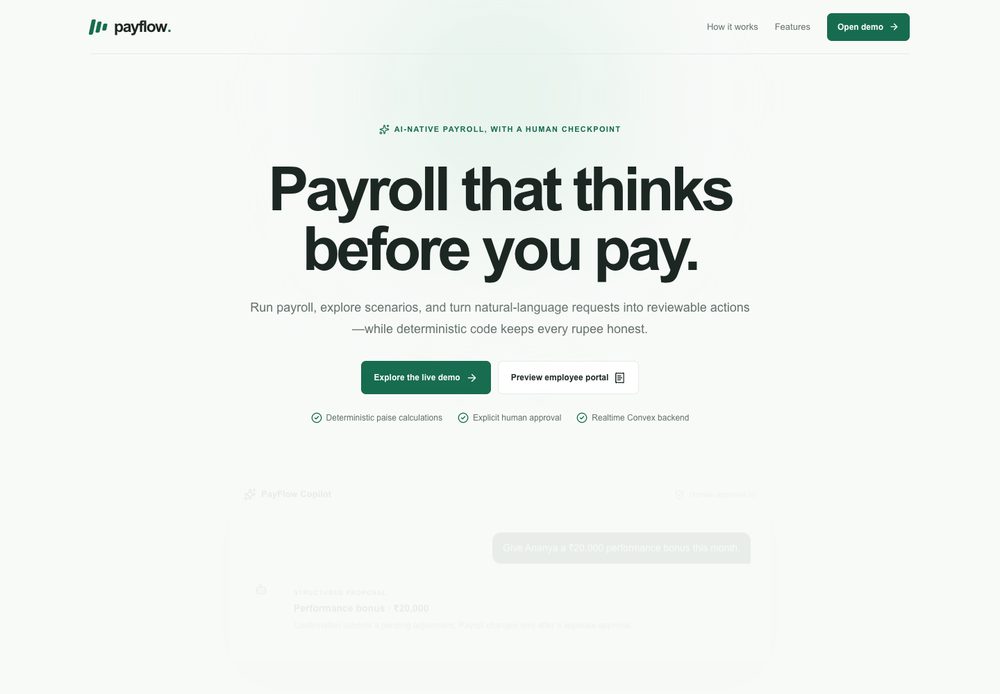
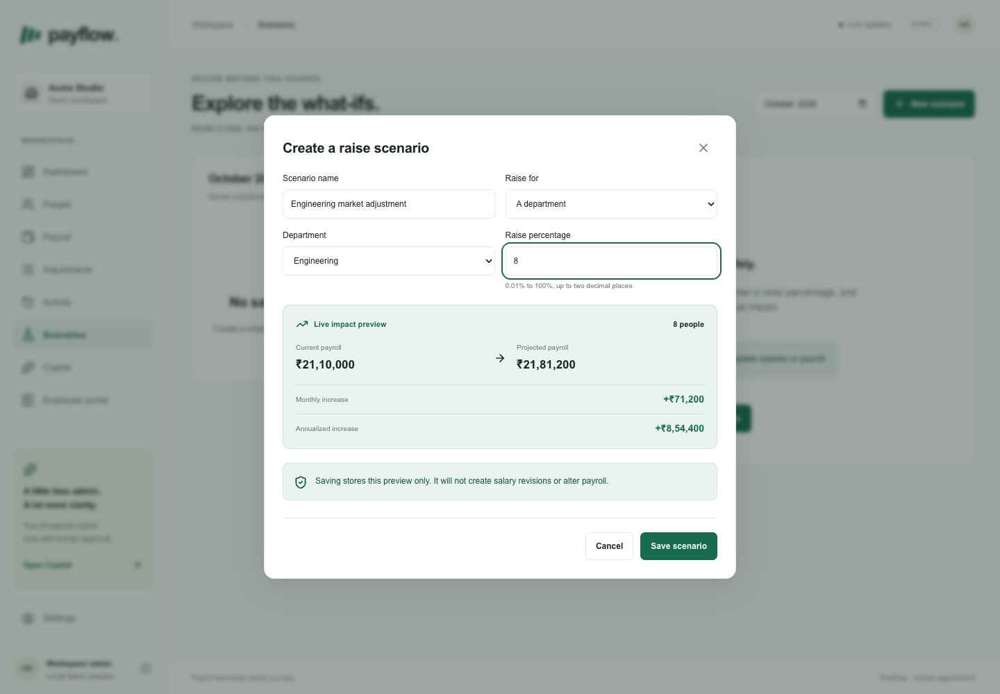
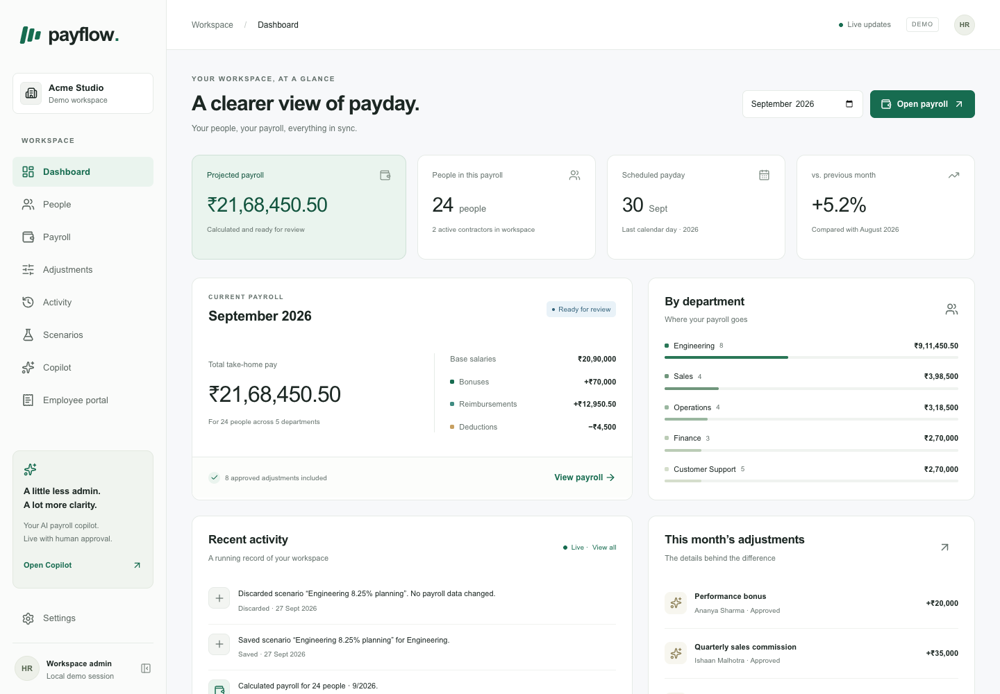
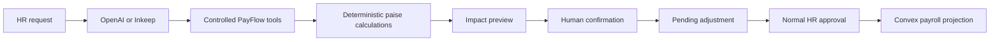

<p align="center">
  
</p>

<h1 align="center">Payroll that thinks before you pay.</h1>

<p align="center">
  An AI-native payroll operations demo for the Modern Stack Hackathon.<br />
  Ask, preview, approve—while deterministic code keeps every rupee honest.
</p>



## What is PayFlow?

PayFlow gives HR and finance teams one realtime workspace for employees, compensation, adjustments, payroll runs, scenarios, and finalized payslips. Its AI Copilot can interpret a payroll request and prepare a structured action, but it cannot silently change payroll or become the source of financial truth.

> **AI interprets intent. Application code calculates money. Humans approve changes.**

## The hero workflow

Ask what an 8% Engineering raise would cost. Scenario Mode resolves the eligible team, calculates every amount in integer paise, and shows the monthly and annual impact without changing compensation or payroll.



Captured October example, including a fictional ₹20,000 bonus added during browser verification:

- **8 people** affected
- **₹21,10,000 → ₹21,81,200** projected monthly payroll
- **₹71,200/month** increase
- **₹8,54,400/year** annualized impact
- **₹0 applied** to live compensation

The Copilot follows the same safety model for an action such as “Give Ananya a ₹20,000 performance bonus this month.” It resolves the employee, validates the INR amount, calculates impact, asks for confirmation, and creates only a pending adjustment. The normal adjustment approval remains a separate decision.

## Product surfaces

- **Realtime dashboard** — payroll totals, department costs, adjustments, and activity update through Convex subscriptions.
- **People lifecycle** — onboard, edit, revise compensation, schedule an employment end, reactivate, and inspect history.
- **Payroll operations** — create, calculate, review, approve, and finalize immutable monthly snapshots.
- **Scenario Mode** — model employee or department raises without an apply path.
- **AI Payroll Copilot** — OpenAI Responses or Inkeep Chat tools with persisted proposals and source-version checks.
- **Employee portal preview** — processed-run payslips, browser print/PDF, and optional audited Resend delivery.



## How it works



Convex is the application source of truth. The browser subscribes to typed queries; mutations enforce company boundaries, payroll states, snapshot protection, and financial validation. Model output is treated as untrusted input and never receives arbitrary database access.

## Built with

- Next.js 16 and React 19
- TypeScript 6 and Tailwind CSS 4
- Convex realtime database, queries, mutations, and transactions
- OpenAI Responses API with an alternate Inkeep Chat adapter
- Optional Resend payslip delivery
- Vitest and `convex-test`

## Demo

- Local landing page: [http://127.0.0.1:3000/welcome](http://127.0.0.1:3000/welcome)
- Local HR workspace: [http://127.0.0.1:3000/?period=2026-09](http://127.0.0.1:3000/?period=2026-09)
- Local employee preview: [http://127.0.0.1:3000/portal](http://127.0.0.1:3000/portal)

The local frontend is currently connected to the verified hosted Convex development deployment at `https://vivid-akita-75.eu-west-1.convex.cloud`. This is a backend API endpoint, not the public PayFlow website. Frontend hosting remains to be configured.

The current hosted development database keeps September ready for review at ₹21,68,450.50. Its clean fictional seed leaves October as a ₹20,90,000 draft. The seed is idempotent and never resets saved work.

Follow the [4–5 minute demo script](docs/DEMO_SCRIPT.md) for the complete employee-to-payslip story.

## Safety boundaries

- Money is stored and calculated as safe integer paise.
- Calculated payroll snapshots cannot be rewritten by later profile, compensation, or lifecycle changes.
- AI proposals require confirmation and still enter the normal approval queue.
- Scenario Mode has no compensation or payroll apply mutation.
- “Processed” means a finalized PayFlow record; it does not mean money moved.
- Missing AI or email credentials disable the action and name the missing configuration. No success is simulated.

## Run locally

Node.js 22+ is recommended.

```bash
npm install
```

Start local Convex in terminal 1:

```bash
npx convex dev
```

Seed the fictional Acme Studio workspace and start Next.js in terminal 2:

```bash
npm run seed
npm run dev
```

The Convex CLI writes `.env.local`, generates API bindings, and persists local data in `.convex/`. Do not commit either path. The first local backend run may require internet access. The existing `.convex/` database remains available even when `.env.local` selects the hosted development deployment.

## Optional providers

Copy the relevant values from `.env.example` into `.env.local`, then restart Next.js.

- OpenAI: `COPILOT_PROVIDER=openai`, `OPENAI_API_KEY`, and optional `OPENAI_MODEL`.
- Inkeep: `COPILOT_PROVIDER=inkeep`, `INKEEP_API_KEY`, `INKEEP_BASE_URL`, and `INKEEP_AGENT_ID`.
- Resend: `RESEND_API_KEY`, `RESEND_FROM_EMAIL`, and `NEXT_PUBLIC_APP_URL`.

All provider keys remain server-side. `NEXT_PUBLIC_CONVEX_URL` is the Convex client endpoint; the application does not use Convex HTTP actions.

## Verify

```bash
npm test
npm run lint
npm run typecheck
npm run format:check
npm run build
# Requires running Convex and the saved September snapshot:
npm run smoke
```

See the [test log](docs/TEST_LOG.md) for the last verified results and [deployment runbook](docs/DEPLOYMENT.md) before hosting.

## Project documentation

- [Product and demo story](docs/PRODUCT.md)
- [Architecture and trust boundaries](docs/ARCHITECTURE.md)
- [Decisions](docs/DECISIONS.md)
- [Roadmap](docs/ROADMAP.md)
- [Marketing launch kit](docs/MARKETING.md)
- [Distribution log](docs/DISTRIBUTION_LOG.md)

## Current scope

PayFlow is an unauthenticated hackathon demo with fictional data. Production authentication/RBAC, statutory Indian payroll, bank transfers, hourly timesheets, proration, controlled payroll reopening, and enterprise integrations remain outside scope. Browser printing provides the current PDF path. Live email, Copilot provider acceptance, and public deployment require user-owned credentials and infrastructure.
